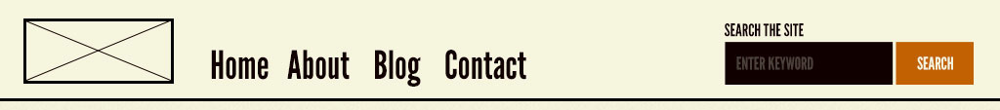
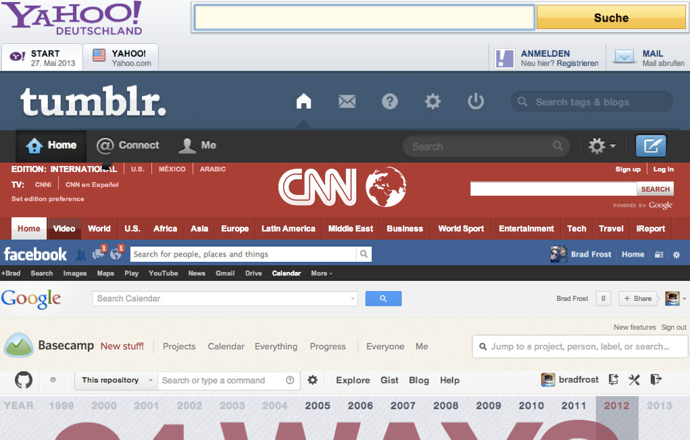

# React & Redux

## Angular vs React vs Vue
* Angular - a lot of developers with a Massive project
* React - a strong developer team and needs to be flexible and evolve by adding different libraries and tools to the ecosystem
* Vue - simple way of writing code, especially for junior developers

* Angular - it like the kitchen. An entire kitchen with all the tools you need to cook whatever you want and everybody works in the same kitchen.
* React - React is the oven.
* Vue - Vue is the microwave.

## JS Basics

### 1. Spread and Rest operators

**Spread:** Used to split up array elements or object properties
```js
const oldArray = [1, 2, 3]
const newArray = [...oldArray, 1, 2] // [1, 2, 3, 4]

const oldObj = {
  name: 'Foyez',
  gender: 'male'
}
const newObj = { 
  ...oldObj, 
  age: 5 
}
```

**Rest:** Used to merge a list of function arguments into an array
```js
function filterArgs(...args) {
  return args.filter(arg => args === 1)
}
sortArgs(1, 2, 3, 1) // [1, 1]
```

### 2. Destructuring
**Destructuring:** Easily extract array elements or object properties and store them in variables. Spread takes out all properties or elements and distributes them in a new array or object. Destructuring allows to pull out single elements or properties and store them in variables for arrays.

```js
[one, , three] = [1, 2, 3]
{ name } = { name: 'Max', age: 28 }
```

### 3. Primitive and Reference Types

```js
// Primitive
const a = 1

// Reference - Array & Object
const person = {
  name: 'Foyez'
}
const secondPerson = person
person.name = 'Manu'
console.log(secondPerson) // secondPerson{ name: 'Manu' }

const person = {
  name: 'Foyez'
}
const secondPerson = {
  ...person
}
person.name = 'Manu'

console.log(secondPerson) // secondPerson{ name: 'Foyez' }
```

## React Principles

### 1. Components

`
Atoms --> Molecules --> Organisms --> Templates --> Pages
`
[Atomic Design](http://bradfrost.com/blog/post/atomic-web-design/)

I. Atom - Basic building blocks. Atoms are our HTML tags, such as a form label, an input or a button. Atoms can also include more abstract elements like color palettes, fonts and animations.


II. Molecules - Groups of atoms bonded together and are the smallest fundamental units of a compound or building block. For example, the combination of a form label, input or button together are called molecule.


III. Organisms - Organisms are groups of molecules joined together to form a relatively complex, distinct section of an interface.

Organisms can consist of similar and/or different molecule types. For example, a masthead organism might consist of diverse components like a logo, primary navigation, search form, and list of social media channels. But a “product grid” organism might consist of the same molecule (possibly containing a product image, product title and price) repeated over and over again.




IV. Templates


V. Pages


### 02. One Way Data Flow
Data flows from top to bottom and never the other way around.

### 03. Virtual DOM

## React Router
**React Router APIs:**

1. Browser Router - hold the information about all routes
2. Switch - used for grouping routes
3. Route - display a specific route
4. Link - serve like anchor tag
5. withRouter - used with Higher Order Component e.g., with Redux

# Redux

## Why Redux?
* Good for managing large state
* Useful for sharing data between containers
* Predictable state management using the 3 principles

## The 3 Principles
1. Single source of truth
2. State is read only
3. Changes using pure functions

```
Action --> Reducer --> Store --> Make Changes
```

## Flux Pattern
```
Action --> Dispatcher --> Store --> View
```

## MVC
```
Action --> Controller --> Model --> View
```

# React & Redux Popular Tools
1. React Router
2. Ramda
3. Lodash
4. Glamorous
5. Styled-components
6. css-modules
7. gatsbyjs
8. next.js - zeit.co/blog/next5
9. material-ui
10. semantic-ui
11. Reselect
12. Redux-Saga
13. immutable-js
14. MDB React
15. React Transition Group
16. React Motion
17. React Move
18. React Router Transition